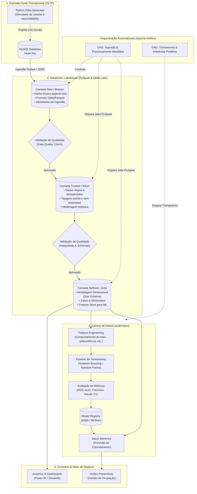

# Pet Hotel Analytics & ML Platform

<p align="center">
  
  
  
  
  
  
  
  
  
</p>

---

## Sumário
* [Sobre o Projeto](#sobre-o-projeto)
* [Origem e Evolução: Da Sala de Aula ao Mundo Real](#origem-e-evolu%C3%A7%C3%A3o-da-sala-de-aula-ao-mundo-real)
* [Arquitetura de Dados de Ponta a Ponta](#arquitetura-de-dados-de-ponta-a-ponta)
* [Estado Atual vs. Visão Futura](#estado-atual-vs-vis%C3%A3o-futura)
* [Arquitetura Medallion no Databricks](#arquitetura-medallion-no-databricks)
* [Ciência de Dados e Machine Learning](#ci%C3%AAncia-de-dados-e-machine-learning)
* [Governança e Qualidade de Dados](#governan%C3%A7a-e-qualidade-de-dados)
* [Roadmap de Desenvolvimento](#roadmap-de-desenvolvimento)
* [Estrutura de Diretórios](#estrutura-de-diret%C3%B3rios)
* [Como Executar o Projeto](#como-executar-o-projeto)
* [Autor e Créditos](#autor-e-cr%C3%A9ditos)

---

## Sobre o Projeto

O **Pet Hotel Analytics & ML Platform** é uma plataforma de **Engenharia e Ciência de Dados** voltada para o setor de hotelaria e serviços para animais de estimação.

O projeto integra o ciclo completo de dados, desde o **banco de dados transacional (OLTP)** operacional de um hotel para pets até um **Data Lakehouse distribuído** com orquestração automatizada de pipelines, validação contínua de qualidade de dados e modelos preditivos de **Machine Learning** para suporte à tomada de decisões estratégicas.

### Desafios de Negócio Endereçados:
1. **Operação e Gestão**: Controle de cadastros, alocação de quartos, estadias, serviços veterinários, banho/tosa e faturamento.
2. **Engenharia de Dados em Escala**: Ingestão contínua e processamento distribuído de dados históricos com garantia de integridade, rastreabilidade e linhagem.
3. **Inteligência Preditiva**: Mitigação de perda de receita por meio de previsão antecipada de cancelamentos de reservas (*no-show*) e análise de demanda sazonal.

---

## Origem e Evolução: Da Sala de Aula ao Mundo Real

> *"Grandes projetos nascem de ideias sólidas e crescem através da visão e dedicação contínua."*

Este projeto teve seu ponto de partida como um trabalho acadêmico em um curso de **Administração de Banco de Dados (DBA)**, desenvolvido originalmente em grupo por 4 alunos para entrega e avaliação curricular.

A fundação relacional do projeto — que inclui a modelagem conceitual (MER), criação dos esquemas normalizados em MySQL, regras de negócio e dicionário de dados — foi desenhada e estruturada pelo autor deste repositório como parte daquela entrega original.

### A Nova Fase: Construindo um Pipeline Enterprise
Com o curso concluído, o projeto foi desacoplado da sua versão acadêmica e assumido como um **projeto autoral contínuo de Engenharia e Ciência de Dados**. O objetivo nesta etapa é elevar a arquitetura ao padrão de mercado (*production-ready*), incorporando ferramentas modernas e boas práticas de engenharia de software e dados.

---

## Arquitetura de Dados de Ponta a Ponta

A arquitetura do projeto conecta o ambiente transacional à inteligência preditiva através de um fluxo desacoplado:



---

## Estado Atual vs. Visão Futura

| Dimensão | Estado Atual (Legado DBA) | Nova Arquitetura (Em Construção) |
| :--- | :--- | :--- |
| **Foco Principal** | Banco de Dados Relacional e Consultas SQL | Pipeline de Dados End-to-End & Ciência de Dados |
| **Banco Transacional** | MySQL com dados de teste manuais | MySQL populado por gerador sintético em larga escala |
| **Ingestão** | Inexistente (execução manual via SQL) | Scripts Python modulares e orquestrados |
| **Processamento** | Consultas locais pontuais | Processamento distribuído no Databricks com PySpark |
| **Organização do Dado** | Tabelas relacionais em 3FN | Arquitetura Medallion (Raw $\rightarrow$ Trusted $\rightarrow$ Refined) em Delta Lake |
| **Qualidade de Dados** | Apenas constraints SQL (`CHECK`, `FK`) | Framework automatizado de Data Quality com logs e alertas |
| **Orquestração** | Execução manual | DAGs automatizadas no Apache Airflow com monitoramento |
| **Analytics & ML** | Nenhuma camada analítica | Modelo preditivo em `scikit-learn` para prevenção de *no-show* |
| **Ambiente de Dev** | Instalação local direta | Ambiente conteinerizado com Docker Compose |

---

## Arquitetura Medallion no Databricks

O processamento distribuído no Databricks com PySpark divide as responsabilidades em três camadas:

1. **Camada Raw (Bronze)**:
   * Armazena os dados brutos exatamente como chegam da origem MySQL.
   * Estrutura imutável (*append-only*) em Delta Lake, preservando o histórico completo e metadados de auditoria (`_ingested_at`, `_source_file`).
2. **Camada Trusted (Silver)**:
   * Aplica rotinas de limpeza e padronização: tratamento de valores ausentes, correção de tipagem, deduplicação e conformidade com regras de negócio.
   * Tabelas limpas e estruturadas representando entidades de negócio consistentes.
3. **Camada Refined (Gold)**:
   * Dados agregados e organizados em modelagem dimensional (**Star Schema** / Kimball).
   * Contém tabelas **Fato** (`fato_reservas`, `fato_servicos`, `fato_pagamentos`) e **Dimensões** (`dim_cliente`, `dim_pet`, `dim_quarto`, `dim_tempo`, `dim_funcionario`), além de servir como **Feature Store** para os modelos de Machine Learning.

---

## Ciência de Dados e Machine Learning

### Caso de Uso: Previsão de Cancelamento de Reservas (*No-Show*)
* **Problema de Negócio**: O cancelamento tardio de reservas gera ociosidade nos quartos, impede o agendamento de outros clientes e causa perda de receita.
* **Solução Proposta**: Modelo preditivo em **scikit-learn** para classificar o risco de cancelamento de uma reserva no momento da sua criação.
* **Etapas do Pipeline de ML**:
  * **Feature Engineering**: Cálculo de tempo de antecedência da reserva, frequência histórica de estadias do cliente, características do animal (porte/espécie), volume financeiro total e contratação de serviços adicionais.
  * **Algoritmos Avaliados**: Comparação entre `RandomForestClassifier`, `HistGradientBoostingClassifier` e `LogisticRegression`.
  * **Métricas de Avaliação**: Avaliação focada em **F1-Score** e **ROC-AUC** para tratamento de desbalanceamento de classes.
  * **Inferência Operacional**: Geração periódica de *scores* de probabilidade de cancelamento para direcionar ações preventivas da equipe do hotel.

---

## Governança e Qualidade de Dados

A qualidade dos dados é validada em todas as etapas do ciclo de vida:
* **Validação de Schemas**: Garantia de que alterações estruturais nas tabelas fonte não interrompam os pipelines de forma silenciosa.
* **Regras de Integridade**: Checagens automáticas (exemplo: `data_saida > data_entrada`, `valor > 0`, unicidade de identificadores e limites de valores nulos).
* **Controle de Propagação**: Em caso de falha crítica na camada Silver, o pipeline bloqueia a atualização da camada Gold e registra o incidente.

---

## Métricas planejadas e status atual

| Métrica | Estado atual | Meta do projeto |
|---|---|---|
| Tabelas relacionais MySQL (Fase 1 ✅) | 15+ tabelas em 3FN | — |
| Dicionário de dados | Documentado (`docs/Dicionario.md`) | — |
| Volume simulado de reservas (planejado) | — | ~100 mil por ano de operação |
| Tempo de execução da DAG Medallion (planejado) | — | < 5 minutos end-to-end |
| Taxa alvo de aprovação Data Quality | — | ≥ 95% |
| Métricas alvo do modelo preditivo | — | F1-Score ≥ 0.75; ROC-AUC ≥ 0.80 |
| Frequência de treino do modelo | — | Semanal (via DAG dedicada) |
| Frequência de inferência batch | — | Diária |

> As métricas de produção serão atualizadas conforme cada fase do roadmap for concluída.

---

## Roadmap de Desenvolvimento

O cronograma do projeto está organizado em fases modulares:

```
[x] Fase 1: Modelagem Relacional & Schemas MySQL
 |   ├── Criação das tabelas relacionais (3FN)
 |   ├── Dicionário de dados e documentação MER/DER
 |   └── Scripts de teste de integridade e consultas base
 |
[ ] Fase 2: Simulador de Dados & Infraestrutura Local
 |   ├── Criação de gerador de dados sintéticos em Python (Faker) com sazonalidade e histórico
 |   └── Configuração do ambiente conteinerizado (Docker Compose para Airflow e MySQL)
 |
[ ] Fase 3: Ingestão de Dados & Camada Raw (Bronze)
 |   ├── Módulo Python de extração do MySQL (Full & Incremental)
 |   └── Persistência no formato Delta Lake / Parquet com metadados
 |
[ ] Fase 4: Processamento Distribuído no Databricks (PySpark)
 |   ├── Pipeline Raw -> Trusted (Silver): limpeza e conformidade
 |   └── Pipeline Trusted -> Refined (Gold): modelagem dimensional (Star Schema)
 |
[ ] Fase 5: Validação Automatizada de Qualidade (Data Quality)
 |   └── Implementação de suítes de validação de schemas, nulos e limites de negócio
 |
[ ] Fase 6: Pipeline de Machine Learning (scikit-learn)
 |   ├── Feature Store e pipeline de pré-processamento
 |   ├── Treinamento e tuning do modelo de previsão de cancelamento
 |   └── Exportação e rotina de inferência preditiva em lote
 |
[ ] Fase 7: Orquestração com Apache Airflow & Dashboards
     ├── Construção das DAGs de orquestração end-to-end com monitoramento
     └── Dashboard analítico com métricas de negócio e predições
```

---

## Estrutura de Diretórios

```text
hotel-pet-analytics/
├── .github/
│   └── workflows/              # Pipelines de CI/CD (lint, testes)
├── config/                     # Configurações de conexão e parâmetros
│   ├── airflow.cfg
│   └── pipeline_config.yaml
├── dags/                       # Definição das DAGs do Apache Airflow
│   ├── dag_medallion_pipeline.py
│   └── dag_ml_predictive_pipeline.py
├── data_generator/             # Simulador de dados sintéticos em larga escala
│   └── generate_synthetic_data.py
├── database/                   # Modelagem e scripts SQL relacionais (MySQL)
│   ├── 01_create_database.sql
│   ├── 02_create_tables.sql
│   ├── 03_insert_sample_data.sql
│   └── 04_test_reserva.sql
├── docker/                     # Docker Compose e Dockerfiles
│   ├── docker-compose.yml
│   └── Dockerfile.airflow
├── docs/                       # Documentação técnica, dicionário e diagramas
│   ├── Dicionario.md
│   ├── MER.png
│   └── Requisitos.md
├── src/                        # Código-fonte dos módulos da aplicação
│   ├── ingestion/              # Conectores e extração MySQL -> Raw
│   │   ├── __init__.py
│   │   └── mysql_extractor.py
│   ├── pyspark_jobs/           # Jobs distribuídos do Databricks / Spark
│   │   ├── raw_to_trusted.py
│   │   └── trusted_to_refined.py
│   ├── quality/                # Suíte de Data Quality e validações
│   │   ├── __init__.py
│   │   └── data_validator.py
│   └── ml/                     # Módulo de Ciência de Dados & Modelagem
│       ├── __init__.py
│       ├── features.py
│       ├── train.py
│       ├── evaluate.py
│       └── predict.py
├── tests/                      # Testes unitários e de integração (pytest)
│   ├── test_ingestion.py
│   ├── test_pyspark_jobs.py
│   └── test_ml_pipeline.py
├── requirements.txt            # Dependências Python
├── LICENSE.md                  # Termos de licença MIT
└── README.md                   # Documentação principal
```

---

## Como Executar o Projeto

### Pré-requisitos
* **MySQL 8.0+** (ou Docker instalado)
* **Python 3.10+**
* Cliente SQL (MySQL Workbench, DBeaver ou extensão de banco de dados)

### 1. Inicializando o Banco de Dados Relacional
Para criar o banco de dados e as tabelas com as regras de integridade:
```bash
# Conecte-se ao seu servidor MySQL e execute os scripts na ordem:
mysql -u seu_usuario -p < database/01_create_database.sql
mysql -u seu_usuario -p hotel_pet < database/02_create_tables.sql
mysql -u seu_usuario -p hotel_pet < database/03_insert_sample_data.sql
```

### 2. Validando as Consultas Operacionais
Execute o script de teste para simular o fluxo transacional de reserva, serviço e pagamento:
```bash
mysql -u seu_usuario -p hotel_pet < database/04_test_reserva.sql
```

*(Instruções para inicialização dos contêineres Docker, Apache Airflow e execução dos jobs no Databricks serão incorporadas conforme o avanço das próximas fases).*

---

## Autor e Créditos

Este projeto é desenvolvido e mantido por **Thiago** como projeto de portfólio em Engenharia e Ciência de Dados.

> **Reconhecimento Acadêmico**: A estrutura inicial do banco de dados relacional (esquema transacional) foi desenvolvida colaborativamente durante o curso de Administrador de Banco de Dados com colegas de turma, servindo de base para esta expansão analítica.

<p align="center">
  <i>"Tudo quanto fizerem, façam de todo o coração, como para o Senhor, e não para homens." – Colossenses 3:23</i>
</p>

---

## Licença

Este projeto é distribuído sob a licença **MIT**. Consulte o arquivo [LICENSE.md](LICENSE.md) para mais informações.

---

## Autor

**Thiago Fiel de Oliveira**
Cursando Tecnólogo em Ciência de Dados na FIAP · AWS Certified AI Practitioner

[](https://www.linkedin.com/in/thiagofieldeoliveira/)
[](https://github.com/Ant4rez)